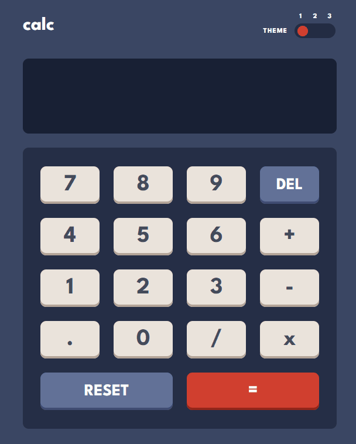
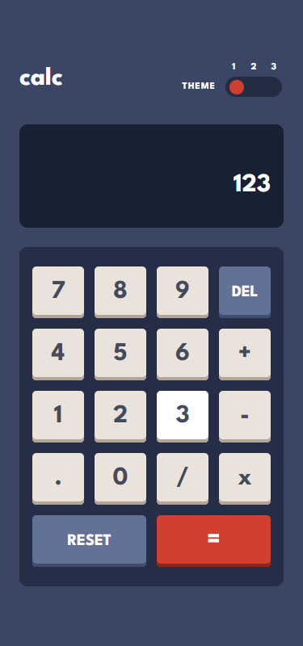

# Calculator App

Challenge from [Frontend Mentor](https://www.frontendmentor.io/)

## Usage

The purpose of this project was to practice HTML, CSS and JavaScript skills with
a design from Frontend Mentor challenge

## Challenge Description

"This calculator app will be a great test of your CSS and JS skills especially.
If you're wanting to practice using Grid, this challenge will be perfect for
you!"

## Tech Stack

**Client:** HTML, CSS, JavaScript

## Authors

- [@haylzrandom - GitHub](https://www.github.com/haylzrandom)
- [@haylzrandom - Frontend Mentor](https://www.frontendmentor.io/profile/HaylzRandom)

## Acknowledgements

- [Calculator App](https://www.frontendmentor.io/challenges/calculator-app-9lteq5N29)

## Related

Here are some related projects

- [Profile Card Component](https://github.com/HaylzRandom/profile-card-component)
- [Order Summary Component](https://github.com/HaylzRandom/order-summary-component)
- [Stats Preview Component](https://github.com/HaylzRandom/stats-preview-card-component)
- [Single Price Grid Component](https://github.com/HaylzRandom/single-price-component)
- [Ping Single Column Page](https://github.com/HaylzRandom/ping-single-column-page)

## Demo

## Screenshots

Desktop

Mobile

